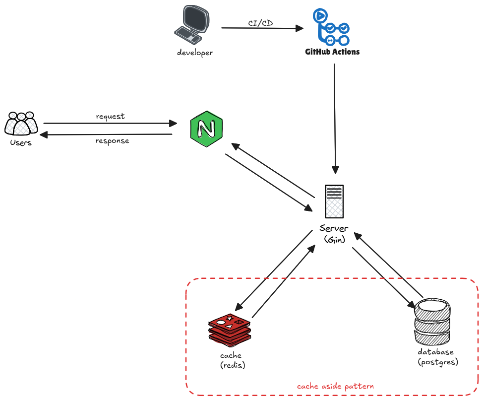
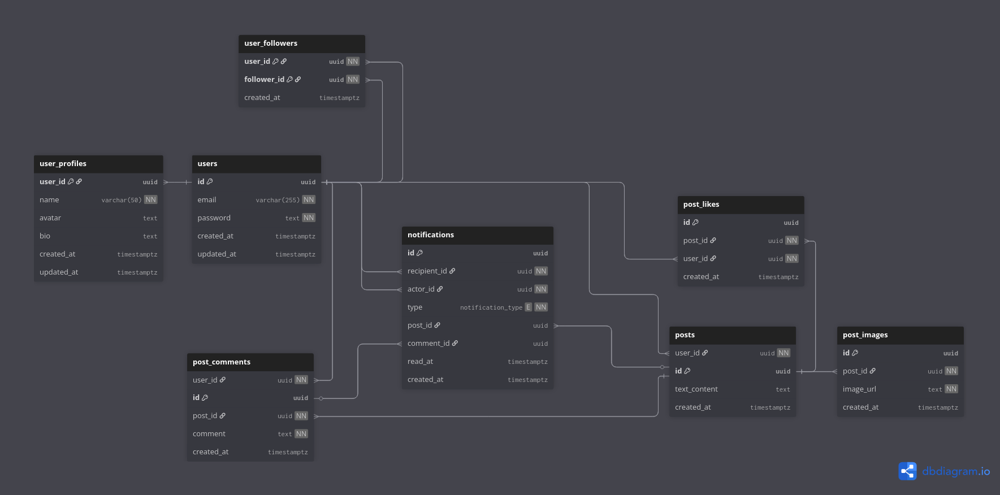

# Social Media Backend

A social media backend API built with Go (Golang) that enables users to create accounts, follow other users, post content, and interact through likes, comments, and notifications.

## 📋 Project Overview

**Social Media Backend** is a RESTful API service for a social networking platform. It provides user authentication, profile management, content creation, feeds, and notifications — all designed with scalability, low latency (via caching), and reliability in mind.

### Technologies Used

* **Go (Golang)** - Main programming language
* **Gin** - Web framework
* **PostgreSQL** - Database (via pgx/v5)
* **Redis** - Caching, token blacklist
* **Docker** - Containerization and deployment

---

## 🏗️ System Design

### Klarifikasi Requirement

#### Functional Requirements:
- User dapat membuat akun dan profil (berisi nama, avatar, dan bio)
- User dapat melakukan login dan logout
- User dapat memfollow user lain
- User dapat membuat postingan (teks, gambar, atau kombinasi keduanya)
- User dapat mem-post beberapa gambar dalam 1 post
- User dapat melihat feed postingan dari user yang difollow (diurutkan berdasarkan waktu terbaru)
- User dapat melakukan interaksi di postingan (like dan comment)
- User dapat melihat notifikasi terkait interaksi user lain (follow, like, dan comment)

#### Non-Functional Requirements:
- **Low Latency**: Feed postingan membutuhkan response time yang cepat (menggunakan caching strategy)
- **Scalability**: Dirancang untuk social media dengan user kecil ~5,000 users dengan arsitektur monolith.
- **Reliability**: Menggunakan PostgreSQL dengan potensi replikasi untuk high availability
- **Security**: JWT-based authentication dengan token blacklist untuk logout
- **Performance**: Redis caching untuk mengurangi database load

### High-Level Design

#### Arsitektur Overview
Aplikasi ini menggunakan **arsitektur monolith** yang cocok untuk skala user saat ini (~5,000 users). Monolith dipilih karena:
- Lebih sederhana dalam development dan deployment
- Maintenance lebih mudah dengan tim kecil
- Latency internal lebih rendah (tidak ada network overhead antar services)
- Cukup untuk handle traffic dengan scale saat ini





#### Caching Strategy (Cache-Aside Pattern):
1. **Read Flow**: 
   - Check Redis cache terlebih dahulu
   - Jika cache miss, query dari PostgreSQL
   - Simpan hasil query ke Redis untuk request berikutnya
2. **Write Flow**: 
   - Write data ke PostgreSQL
   - Invalidate atau update cache di Redis
3. **Cache Key Examples**:
   - Feed: `feed:user:{userID}`
   - User Profile: `user:{userID}`
   - Post: `post:{postID}`

### Low-Level Design

#### Database Schema



#### API Design Principles:

**REST API dengan Versioning**
- Base URL: `/api/v1/`
- Versioning untuk backward compatibility
- Consistent response format (JSON)

**Authentication & Authorization**
- JWT-based authentication
- Bearer token di Authorization header
- Token blacklist menggunakan Redis untuk logout

**CORS Configuration**
- Restricted access untuk security
- Whitelist specific domains (configured in Docker network)

**Static File Handling**
- Images disimpan di file system
- Served melalui `/api/v1/img/*`

#### Endpoint Design:
| Method | Endpoint                 | Cache Strategy    |
|--------|--------------------------|-------------------|
| GET    | `/feed`                  | Cache-aside (TTL) |
| GET    | `/user/:id`              | Cache-aside       |
| POST   | `/post`                  | Cache invalidate  |
| POST   | `/post/like`             | Cache invalidate  |
| POST   | `/post/comment`          | Cache invalidate  |

### Address Key Issues

#### Reliability
- **Database Replication** (Future Enhancement): PostgreSQL dengan master-replica setup
  - Jika master down, automatic failover ke replica
  - Read replica untuk load balancing read operations
- **Docker Health Checks**: Automatic container restart on failure
- **Graceful Shutdown**: Proper connection cleanup saat shutdown

#### Scalability
- **Vertical Scaling**: Increase container resources (CPU, Memory)
- **Horizontal Scaling** (Future): 
  - Multiple backend instances di belakang load balancer
  - Redis Cluster untuk distributed caching
  - PostgreSQL read replicas untuk read-heavy operations

#### Performance
- **Redis Caching**: Mengurangi database load untuk frequent reads
- **Database Indexing**: Index pada foreign keys dan frequently queried columns
- **Connection Pooling**: Efficient database connection management

#### Security
- **JWT Token Expiration**: Automatic token expiry
- **Token Blacklist**: Logout invalidates tokens via Redis
- **Input Validation**: Sanitize dan validate semua user inputs
- **SQL Injection Prevention**: Menggunakan parameterized queries (pgx)

---

## ✅ Features

* **Authentication**
  * User Registration
  * Login
  * Logout (with token blacklist)
* **User Profile**
  * Edit profile (name, avatar, bio)
  * Follow/unfollow users
* **Posts**
  * Create post (text, image, or both)
  * Upload multiple images in one post
  * Like and comment on posts
* **Feed**
  * View posts from followed users (sorted by newest first)
* **Notifications**
  * Receive notifications for follows, likes, and comments

---

## 🚀 Installation

### Prerequisites

* Go 1.25
* PostgreSQL
* Redis
* Docker & Docker Compose (for containerized deployment)

### Environment Variables

Create a `.env` file in the root directory:

```env
# PostgreSQL config
DB_USER=your_user
DB_PASS=your_pass
DB_HOST=pg-db
DB_PORT=5432
DB_NAME=your_db

# Redis config
RDBHOST=rdb
RDBPORT=6379

# JWT
JWT_SECRET=a-string-secret-at-least-256-bits-long
JWT_ISSUER=your_issuer

# Compose overrides
POSTGRES_USER=your_user
POSTGRES_PASSWORD=your_pass
POSTGRES_DB=your_db

DB_HOST_MAKE=localhost
DB_PORT_MAKE=5422
```

---

### Setup Instructions

#### Option 1: Docker Deployment (Recommended)

1. Clone the repository

```bash
git clone https://github.com/yourusername/social-media-backend.git
cd social-media-backend
```

2. Create your `prod.env` file with the environment variables above

3. Start with Docker Compose

```bash
docker compose pull
docker compose up -d
```

4. Run database migrations

```bash
make -f Makefile.prod migrate-up
make -f Makefile.prod insert-seed
```

The application will be available at:

* **Backend API**: `http://localhost:8080`
* **PostgreSQL**: `localhost:5422`
* **Redis**: `localhost:6369`

#### Option 2: Local Development

```bash
git clone https://github.com/yourusername/social-media-backend.git
cd social-media-backend
```

1. Create `.env` file
2. Install dependencies

```bash
go mod download
```

3. Run migrations

```bash
make -f Makefile migrate-up
make -f Makefile insert-seed
```

4. Start the application

```bash
go run main.go
```

Server will run on `http://localhost:8080`.

---

## 📚 API Documentation

### Authentication Endpoints

| Method | Endpoint         | Description   | Auth Required |
| ------ | ---------------- | ------------- | ------------- |
| POST   | `/auth/register` | Register user | ❌             |
| POST   | `/auth/login`    | User login    | ❌             |
| DELETE | `/auth/logout`   | User logout   | ✅             |

### User Endpoints

| Method | Endpoint                 | Description   | Auth Required |
| ------ | ------------------------ | ------------- | ------------- |
| PATCH  | `/user`                  | Edit profile  | ✅             |
| POST   | `/user/:targetID/follow` | Follow a user | ✅             |

### Post Endpoints

| Method | Endpoint        | Description       | Auth Required |
| ------ | --------------- | ----------------- | ------------- |
| POST   | `/post`         | Create a new post | ✅             |
| POST   | `/post/like`    | Like a post       | ✅             |
| POST   | `/post/comment` | Comment on a post | ✅             |

### Feed Endpoints

| Method | Endpoint | Description                                  | Auth Required |
| ------ | -------- | -------------------------------------------- | ------------- |
| GET    | `/feed`  | Get posts from followed users (newest first) | ✅             |

### Static Files

* Images are served under `/api/v1/img/*`

---

## 🔐 Authentication

All protected endpoints use JWT authentication.
Include the token in the `Authorization` header:

```
Authorization: Bearer <your_jwt_token>
```

---

## 🐳 Docker Architecture

The application runs via Docker Compose with:

* **pg-db**: PostgreSQL database (Port: 5422)
* **rdb**: Redis cache (Port: 6369)
* **backend**: Go API service (Port: 8080)

All services share a dedicated Docker network with persistent data volumes.

---

## 📝 Version History

### Version 1.0.0 (Current)

* Initial release
* User registration & authentication
* Profile management
* Posting (with images)
* Feed & interactions
* Redis caching implementation
* JWT-based security

---

## 👥 Contributors

* Radif - [@radifan9](https://github.com/radifan9)

---
